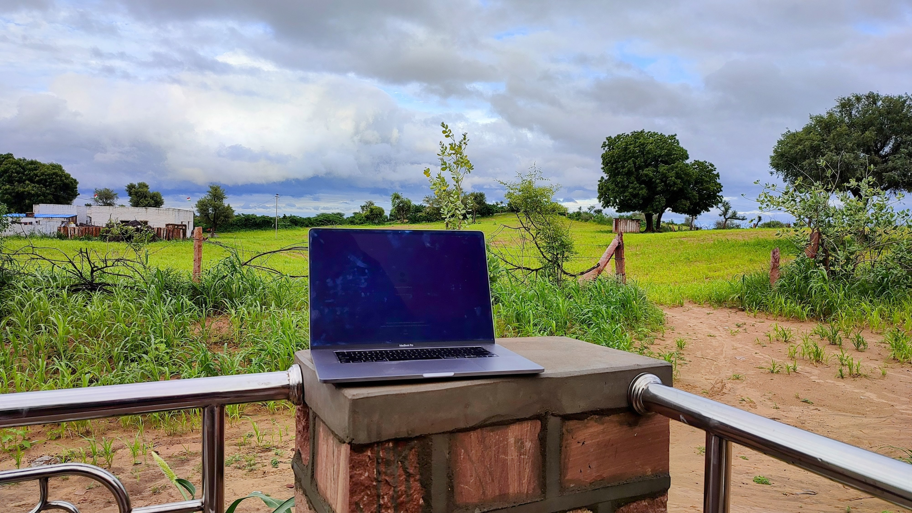
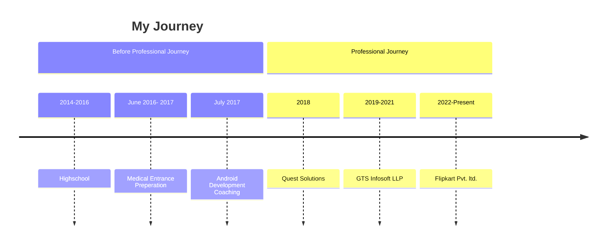

I had never thought that I would come this far. Since childhood, this was my only goal to write code as a profession. Initially, no one was there to guide me and show me the right way to achieve my goals. But my friends and brothers supported and encouraged me that I can make my career in this field.

## Table of contents

## How it started

I started to learn about the basics of websites and how I can create my website.

My first website was on [wapka.mobi](http://wapka.mobi)(now shut down), this platform gave the option to create websites without writing the actual code.

Later on, I wanted to learn more about creating websites from scratch, so I started exploring the basics of FTP, shared servers, HTML, CSS, and PHP.

I learned the basics of these languages by trying and building a few basic websites.

## 2014 - April 2016 (Highschool)

In high school, I opted-in for Biology mainly because my father is a lab technician and he wanted to see me as a doctor; and also I was not interested in Maths.

I learnt HTML, CSS, VBS, and ASP in depth in school and got to know how things work internally. also built a few websites in PHP.

## June 2016 (Medical Entrance preparation)

There are only a few options available after high school for biology students - graduation or preparing for medical entrance.

So I went ahead for Medical Entrance preparation, but deep down I knew that this was not my cup of tea. Meanwhile, I continued to learn and explore PHP and other technical things side by side.

## June 2017 (Android Development coaching)

As expected, I didn't performed well in the medical entrance.

My brother encouraged me to follow my passion, So I decided to take a 3-month course for Android Development (without prior knowledge of Java or Kotlin) during my summer vacations.

I bought my first android mobile. Till here I learnt and implemented everything on Nokia keypad mobiles (X2-01 & 114).

Later I got admission into a distance learning college to pursue BCA. I have seen many developers with degrees doing the same work which I was doing, then what was the need for a degree? So I decided to drop out of college in 2021.

During those 3 months of Android training, I learnt the basics of Android and Kotlin. The coaching institute offered me an internship after the course completion. This was my happiest moment because I was getting closer to my dream job.

Then I went for a JAVA course to get a better understanding of Android. The colleagues were super helpful and they taught me how things work internally. Special Thanks, [Sachin Rupani](https://www.linkedin.com/in/sachin-rupani-23a872bb) & [Suraj Vaishnav](https://www.linkedin.com/in/suraj-vaishnav) for helping out.

## 2018 - Present (Real professional journey started)

I wanted to validate my knowledge so I went ahead and cleared the Associate Android Developer Certificate.

In these 4 years, I worked on many technologies like Android, Flutter, React Native, iOS and Angular and helped other developers too.

After working for 4 years as Android Developer in Jodhpur, I felt like I am stuck in a comfort zone and not growing and learning new things.

So I decided to switch job and began job hunting.
I talked to a lot of my developer friends who are working in different companies to have a better understanding of big organisations work. These long discussions usually included what's new in Android and how to prepare for interviews.

I gave around 28 interviews, some of them went really well and some of them didn't.

A few companies rejected me because not having a degree, but many did not care about the degree.
and then after 2 months of job hunting, I finally got a job offer from Flipkart, which gave me immense happiness and made me even more confident in this field.

I come from a small town with not have a lot of guidance to follow their passion and fulfill your dreams.
I think I have broken this misconception about getting into a big organisation without having any degree, This is already encouraging many youngsters from my surrounding to go ahead and follow their passion.

I've come a long way but still have miles to go.

Special thanks to all the blogs and Open-Source projects for helping me in my journey.

Thank you, everyone. ♥️

