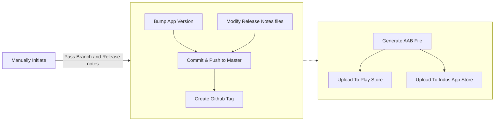

The app release process is a repeatative process and take too much time to version bump, build and upload it to play store or other app stores.

To simplify the process I've automated this process in my project [KeyPass](https://github.com/yogeshpaliyal/KeyPass) using Github Actions.

### Requirements
For most of the apps we have these requirements, there may be different requirements for your app.
1. **Bump type:** major/minor/patch.
1. **Release Notes:** Update the release note for each release.

