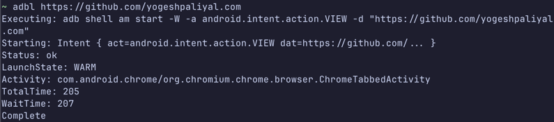
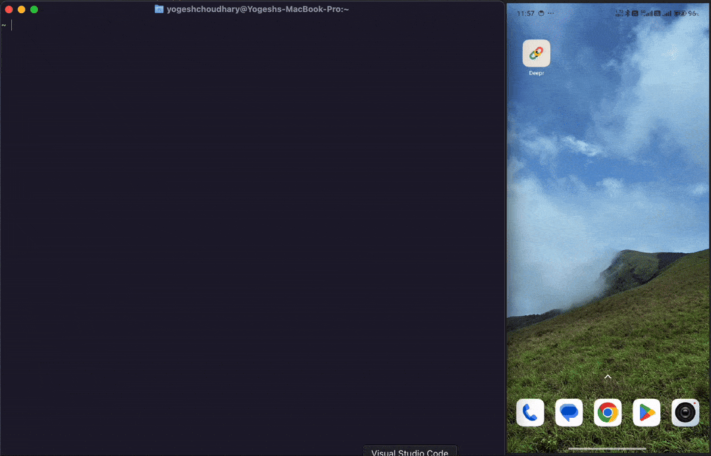

## 📜 Context
Deeplinks are essential for navigating within Android applications, but managing them can be cumbersome, especially when dealing with a long list.  
This quick tip will help you manage your ADB deeplinks from the terminal.  
This solution leverages [fzf](https://github.com/junegunn/fzf), a powerful command-line fuzzy finder, to make deeplink selection intuitive.

## Solution
1. Install **fzf** (Ignore this if you already have it installed)
   - For MacOS, you can use Homebrew:
     ```shell
     brew install fzf
     ```
   - For Linux, you can follow the instructions on the fzf GitHub page.

2. Add the code below to the end of your `.zshrc` file. Use the command `vim ~/.zshrc` to open the file in your terminal.
```shell
adbl() {
    # Check if fzf is installed
    if ! command -v fzf &> /dev/null; then
        echo "Error: fzf is not installed. Please install it to use this function."
        echo "e.g., brew install fzf"
        return 1
    fi

    local HISTORY_FILE=~/.adbl_history
    # Create the history file if it doesn't exist
    touch "$HISTORY_FILE"

    local uri

    # If an argument is passed, use it directly.
    if [ -n "$1" ]; then
        uri="$1"
    else
        # Otherwise, show the fzf history selector.
        # --print-query prints the query and then the selection.
        # We take the last line of the output (`tail -n 1`), which is the selection
        # if one is made, or the query itself if the user just presses Enter.
        uri=$(fzf --tac --height 40% --border --prompt="Select or type a new deeplink > " \
            --header="[Enter] to select, [Esc] to cancel." \
            --print-query < "$HISTORY_FILE" | tail -n 1)
    fi

    # Exit if the user cancelled fzf or the URI is empty
    if [ -z "$uri" ]; then
        echo "No deeplink selected."
        return 1
    fi

    # Execute the adb command
    echo "Executing: adb shell am start -W -a android.intent.action.VIEW -d \"$uri\""
    adb shell am start -W -a android.intent.action.VIEW -d "$uri"

    # If the command was successful, save the URI to history (if it's not already there)
    if [ $? -eq 0 ]; then
        # Use grep to check if the exact line already exists
        if ! grep -q -F -x "$uri" "$HISTORY_FILE"; then
            echo "$uri" >> "$HISTORY_FILE"
        fi
    fi
}
```

3. Reload your terminal or run `source ~/.zshrc` to apply the changes.

### Usage
#### Inline Usage
You can now use the `adbl` command to manage your ADB deeplinks:
```shell
adbl <your_deeplink>
```
This command executes the provided deeplink and saves it to a history file for future use.


#### Interactive Usage
If you run `adbl` without any arguments, it will show a list of previously used deeplinks using `fzf`, allowing you to select one or type a new one.


If you select a deeplink, it will internally execute this command:   
_**adb shell am start -W -a android.intent.action.VIEW -d "<selected_deeplink>"**_

## ⚠️ Things to keep in mind
1. Ensure that you have `adb` installed and your device is connected.
2. The history file is stored at `~/.adbl_history`, and you can view or edit it if needed.
3. If you want to clear the history, you can simply delete the `~/.adbl_history` file.
4. If you want to use this command in a different shell (like `bash`), you may need to adjust the syntax accordingly.
5. If you are connecting a **multiple android devices** you can refer to this blog post [here](https://medium.com/@theapache64/adb-say-bye-to-multi-device-error-240ba10777a2) by [theApache64](https://github.com/theapache64).

## Bonus
If you want to manage your deeplinks in an Android **device**, you can use [Deepr](https://github.com/yogeshpaliyal/Deepr)

## 📒 Conclusions
By using this command, you can easily manage and execute ADB deeplinks directly from your terminal, making it more efficient to test and navigate within your Android applications.

